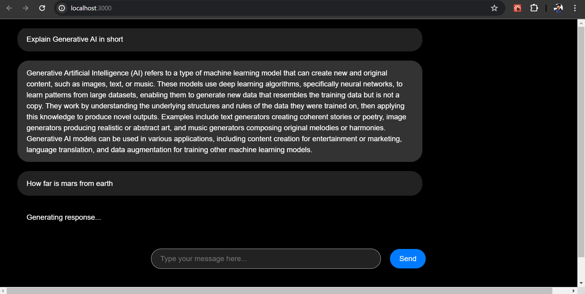

# SpringAi + ollama

This project demonstrates the implementation of Large language models (LLMs) and SpringBoot using Ollama and Spring AI to run the models locally.


## Tech Stack

**Client:** React, Redux

**Server:** SpringBoot


## Installation

Install and Run Ollama

https://ollama.com/download

Once you have ollama downloaded, open terminal and type below commands to pull the LLMs and run them locally.

```bash
  ollama run llama2 # pulls llama2 LLM model
  ollama run mistral # pulls and runs mistral LLM
```
    
## Getting Started

1. Ensure ollama is Running: Execute the commands mentioned above to confirm that ollama is running on your system.
2. Clone the Repository: Clone the repository to your local machine and launch the spring application using the provided commands.
3. Verify API Functionality: Utilize Postman to verify that the mentioned APIs are functioning correctly.
4. Start mychatbot React Application: Initiate the mychatbot React application by executing the npm start command.
Send a Message: Once the React application is running, send a message and await the response.

By following these steps, you'll be ready to interact with the system seamlessly.

## API Reference

#### Get all items

```http
  POST http://localhost:8080/api/v1/chat
```

Request Body:

{
    "strings": "What is revenue of zerodha for FY2022"
}


## Guid

https://docs.spring.io/spring-ai/reference/api/clients/ollama-chat.html


## Demo



